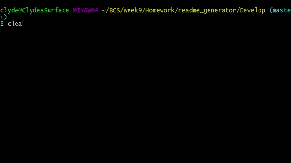

# Readme Generator

## Description
---
[](https://opensource.org/licenses/MIT)

This project utilizes `node.js` and `npm` to create a readme generator within `gitbash`. After a series of prompts, the user will be able to choose the file name of the md file and will be notified of the success of the save of their new file.




---
## Table of Contents 

* [Installation](#Installation)
* [Usage](#Usage)
* [Credits](#Credits)
* [License](#License)
* [Tests](#Tests)
* [Questions?](#Questions?)

---
## Installation

After downloading the code, open `gitbash` and navigate inside the `/Develop` folder. Once there, run the command
```
npm install
```
and `inquirer` and `util` will be installed automatically as they are specified in the `package.json` file.

## Usage

This project is meant to genereate md files in the format of a README. All information such as licensing are independent of any repository and independant of the github username except for the link to their github profile.

After installation, simply type in the command
```
node index.js
```
while in the `/Develop` folder to run the program.

## License

© 2020 [Clyde Baron Rapinan](https://github.com/clydebaron2000). Under the [MIT](https://opensource.org/licenses/MIT) license.


## Contributing

Feel free to contribute to this project.

## Tests

There are currently no automated tests for this repository. All local testing should be done on `gitbash`.

## Questions?

Have questions about my project? [Email me](mailto:crapinan@ucsd.edu) at crapinan@ucsd.edu.

---
Check out my other projects [here!](https://github.com/clydebaron2000)